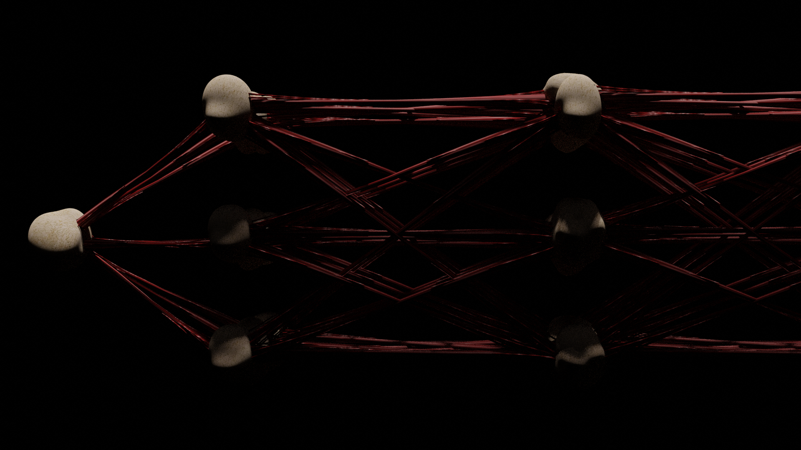
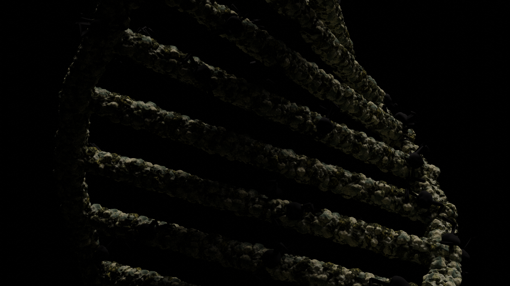

### NFT
[tsigoloib](https://opensea.io/tsigoloib), biologist backward is an biology and artificial intelligence inspired NFT minted on opensea.io polygon chain since June 2021 using Blender 3D modeling. The theme here combine the aspect of biology such as virus/disease and technology such as artificial intelligence and cyber crime. 
| | | | | |
|:-------------------------:|:-------------------------:| :-------------------------:|:-------------------------:|:-------------------------:|
| | | | | |
| ||  |  |  |

<!---
### Medium
My latest writing on medium:

<a target="_blank" href="https://github-readme-medium-recent-article.vercel.app/medium/@TisanaWanwarn/0"> 
-->
  
  

